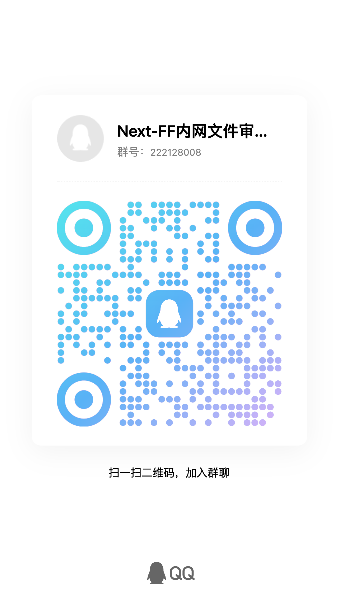
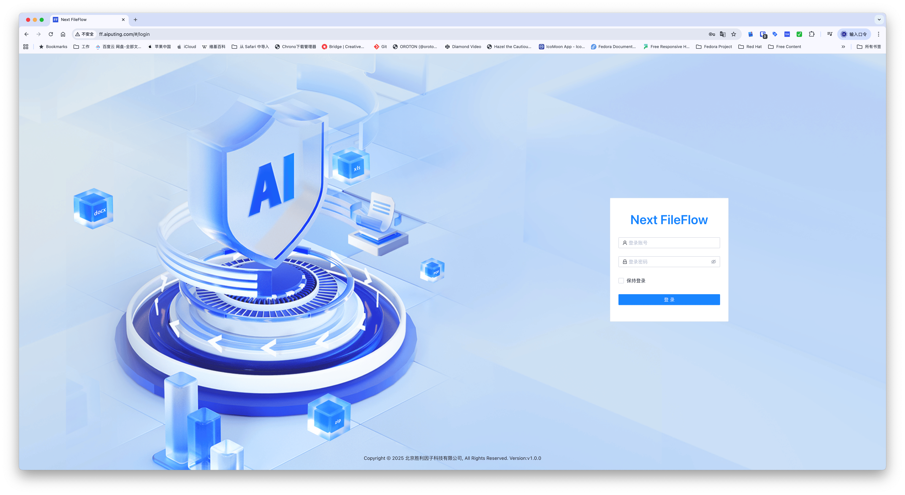
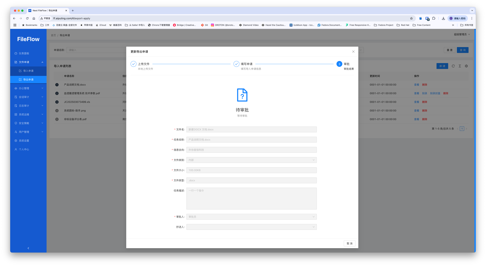
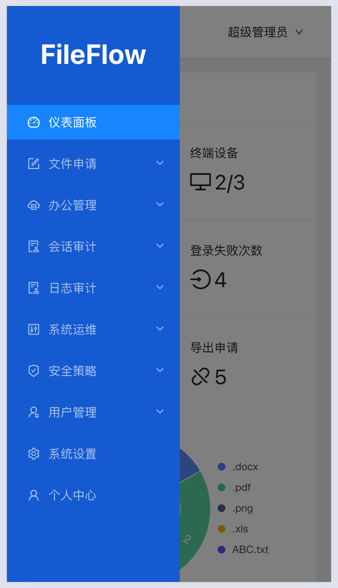
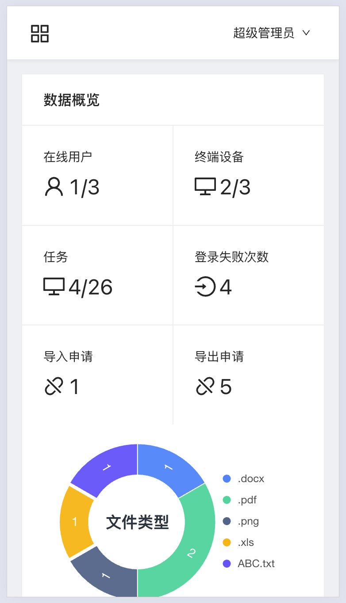

# Next-FileFlow

## 开始

​企业轻量级内外网文件审计系统是一款专为现代化办公场景设计的综合性文件安全管理平台，全面覆盖文件传输、存储、审计及权限管控全流程。系统深度融合智能化技术与企业级安全规范，助力企业实现高效合规的文件流转与管理。

## 项目名称
Next-FileFlow ​企业轻量级内外网文件审计系统

## 免费体验公测
扫码进QQ群体验

## 项目描述
项目介绍

1.全流程审批管理​  
​人工+自动双模审批​：支持基于角色、部门的多级审批流程定制，可设置文件类型、大小等触发条件实现规则化自动审批  
​审批留痕追溯​：完整记录审批意见、操作人员及时间节点，审计日志符合ISO27001标准 

​2.大文件高效传输​  
​智能分片续传​：支持TB级文件断点续传，网络波动自动重试，传输稳定性达99.99%  
​带宽动态调控​：根据业务优先级智能分配传输资源，关键业务带宽保障 

​3.物理介质管控​  
​光驱刻录审计​：记录光盘刻录内容、操作人员及设备信息，支持刻录前敏感内容扫描  
<!-- ​USB设备鉴权​：对接加密U盾体系，非授权外设自动阻断并告警 -->

​4.安全内网云盘​  
​跨网闸同步​：通过安全摆渡机制实现内外网文件受控交换 

​5.智能内容审计​  
​多维度扫描引擎​：内置多种文件格式解析能力  
​敏感规则库​：预置金融、法律、医疗等行业特征规则，支持正则表达式自定义  
​AI增强分析​：支持 deepseek 内网独立部署接口 基于NLP的上下文语义识别，误报率低于0.5% 

​6.敏感规则与AI大模型调试训练  
​大模型行为预测​：通过Transformer架构分析用户操作模式，实时预警异常文件流转  
​智能分类标签​：自动生成文件密级标签，准确率超95%  
支持自定义敏感规则，可以调教验证敏感规则与AI模型符合程度。 

​7.实时态势感知​  
​多级告警通知​：邮件通道分级告警  
​可视化仪表盘​：实时展示全网文件流转热力图与风险事件分布 

​8.统一身份管理​  
​LDAP/AD深度集成​：同步组织架构与职务属性，权限变更实时生效  
​RBAC权限模型​：细粒度控制到文件级访问、编辑、分享权限; 系统支持IP段白名单登录控制、支持各IP段在特定工作日、特定工作时间内使用

​9.移动安全接入​  
​零信任移动端​：国密算法加密通道，兼容iOS/Android原生文件沙箱管控  
​水印溯源​：移动端查阅自动添加动态用户IP使用时段与上传下载访问控制。 

​10.网络层防护​  
​IP黑白名单​：支持CIDR格式网段控制，精确到端口级的访问策略 
​GeoIP过滤​：自动阻断高风险地域IP访问请求 
 
​11.智能运维体系​ 
​自动化基线核查​：每日执行安全配置合规性检查并生成修复建议  
​智能容量预测​：基于LSTM算法预判存储资源使用趋势

## 徽章标识
无

## 视觉示例

## 安装指南
内网独立安装部署请微信扫码知识星球持续完善中。

## 使用示例
无

## 支持渠道
提供社区支持

微信群支持

邮件: business@aiputing.com

## 发展路线

## 下载地址
下载地址:https://f.aiputing.com/?p=Next-FileFlow%2F

## 致谢名单
 

## License
保留版权

版权: 北京胜利因子科技有限公司

官网: https://license.aiputing.com
## 项目状态
交付发布

This is an automated change - 2025-08-06 07:46:02
