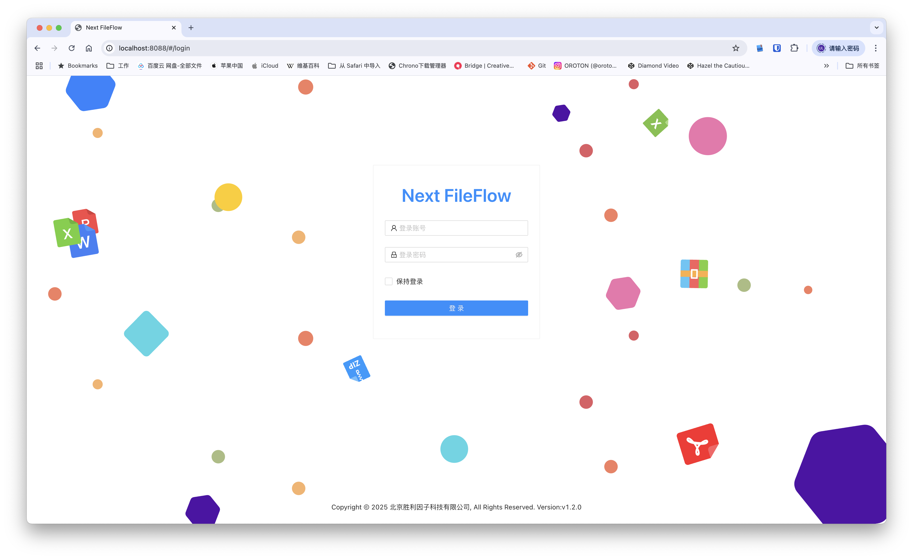

# Next-FileFlow

## 开始

​企业轻量级内外网文件审计系统是一款专为现代化办公场景设计的综合性文件安全管理平台，全面覆盖文件传输、存储、审计及权限管控全流程。系统深度融合智能化技术与企业级安全规范，助力企业实现高效合规的文件流转与管理。

## 项目名称
Next-FileFlow ​企业轻量级内外网文件审计系统

## 文档
[https://doc.aiputing.com/fileflow](https://doc.aiputing.com/fileflow)
<!-- ## 免费体验公测
扫码进QQ群体验
 -->

## 项目描述
项目介绍

1.全流程审批管理​  
​人工+自动双模审批​：支持基于角色、部门的多级审批流程定制，可设置文件类型、大小等触发条件实现规则化自动审批  
​审批留痕追溯​：完整记录审批意见、操作人员及时间节点，审计日志符合ISO27001标准 

​2.大文件高效传输​  
​智能分片续传​：支持TB级文件断点续传，网络波动自动重试，传输稳定性达99.99%  
​带宽动态调控​：根据业务优先级智能分配传输资源，关键业务带宽保障 

​3.物理介质管控​  
​光驱刻录审计​：记录光盘刻录内容、操作人员及设备信息，支持刻录前敏感内容扫描  
<!-- ​USB设备鉴权​：对接加密U盾体系，非授权外设自动阻断并告警 -->

​4.安全内网云盘​  
​跨网闸同步​：通过安全摆渡机制实现内外网文件受控交换 

​5.智能内容审计​  
​多维度扫描引擎​：内置多种文件格式解析能力  
​敏感规则库​：预置金融、法律、医疗等行业特征规则，支持正则表达式自定义  
​AI增强分析​：支持 deepseek 内网独立部署接口 基于NLP的上下文语义识别，误报率低于0.5% 

​6.敏感规则与AI大模型调试训练  
​大模型行为预测​：通过Transformer架构分析用户操作模式，实时预警异常文件流转  
​智能分类标签​：自动生成文件密级标签，准确率超95%  
支持自定义敏感规则，可以调教验证敏感规则与AI模型符合程度。 

​7.实时态势感知​  
​多级告警通知​：邮件通道分级告警  
​可视化仪表盘​：实时展示全网文件流转热力图与风险事件分布 

​8.统一身份管理​  
​LDAP/AD深度集成​：同步组织架构与职务属性，权限变更实时生效  
​RBAC权限模型​：细粒度控制到文件级访问、编辑、分享权限; 系统支持IP段白名单登录控制、支持各IP段在特定工作日、特定工作时间内使用

​9.移动安全接入​  
​零信任移动端​：国密算法加密通道，兼容iOS/Android原生文件沙箱管控  
​水印溯源​：移动端查阅自动添加动态用户IP使用时段与上传下载访问控制。 

​10.网络层防护​  
​IP黑白名单​：支持CIDR格式网段控制，精确到端口级的访问策略 
​GeoIP过滤​：自动阻断高风险地域IP访问请求 
 
​11.智能运维体系​ 
​自动化基线核查​：每日执行安全配置合规性检查并生成修复建议  
​智能容量预测​：基于LSTM算法预判存储资源使用趋势

## 徽章标识
无

 
## 视觉示例

## 安装指南
内网独立安装部署请微信扫码知识星球持续完善中。

## 使用示例
无

## 支持渠道
提供社区支持

微信群支持  
添加后回复 ff 

 

邮件: business@aiputing.com

## 发展路线

## 下载地址
下载地址:https://f.aiputing.com/?p=Next-FileFlow%2F

## 致谢名单
 

## License
# Next-DBM

[English](README.md) ｜ [中文](README_zh.md)

## 开始

企业轻量级数据库审计版本管理系统
Next DBM 支持数据库连接日志审计，代理权限统一管理。
支持数据版本管理。支持数据库脚本自动构建部署实施。
支持WEB操作数据库基本管理功能。

## 项目名称
Next-DBM 企业轻量级数据库审计版本管理系统

## 项目描述
项目介绍

1.支持多种数据库连接​  
支持多种数据代理连接，可以使用常用dBMS进行连接，支持MySQL、MariaDB、Oracle、SQLServer、PostgreSQL、MongoDB、Redis、MSSQL、MongoDB、客户端连接Next-DBM代理端口实

​2.支持WEB与代理服务  
可以通过WEB操作数据库基本管理功能， 
使用代理TCP连接，支持连接状态查看命令查看进行审计管理。

​3.支持版本管理  
通过将SQL语句保存SQL文件进行git版本管理。将关键核心表结构与数据通过版本服务器的方式管理起来。

​4.支持构建恢复数据库  
可以在历史版本中恢复数据库。支持恢复新数据库与原库数据库进行恢复。

​5.敏感指令过滤  
支持自定义敏感规则，敏感规则组实现账号或用户组根据不同情况配置控制敏感指令。

​6.出发指令版本构建  
支持配置触发指令实现版本备份管理。如可以配置alter、insert、update、delete指令实现版本控制。

​7.支持自主表结构与表数据版本控制   
支持版本按表结构与数据过滤实现版本备份管理历史版本管理功能。

​8.统一身份管理​    
​LDAP/AD深度集成​：同步组织架构与职务属性，权限变更实时生效  
​RBAC权限模型​：细粒度控制到文件级访问、编辑、分享权限 

9.代理服务管理   
支持按不同数据库常用端口分别控制管理
 
10.更多设置功能  
国际化多语言支持，主题切换
 
## 徽章标识
无

## 视觉示例

 
 
 
 

## 安装指南
内网独立安装部署请微信扫码知识星球持续完善中。

## 使用示例
无

## 支持渠道
提供社区支持

微信群支持

邮件: business@aiputing.com

## 发展路线

## 下载地址
下载地址:https://f.aiputing.com/?p=Next-DBM%2F

## 协议与条款
如您需要在企业网络中使用 Next-FileFlow，建议先征求 IT 管理员的同意。下载、使用或分发 Next-FileFlow 前，您必须同意 协议 条款与限制。本项目不提供任何担保，亦不承担任何责任。

## License

Next-FileFlow is a derivative work based on the open-source
project **Next Terminal**, which is licensed under the
Apache License, Version 2.0.

Original code and derived portions remain subject to
the Apache License, Version 2.0.

The project has been significantly modified and extended
to focus on enterprise database audit and version
management scenarios.

See the LICENSE file for details.
This is an automated change - 2026-01-07 18:30:02
